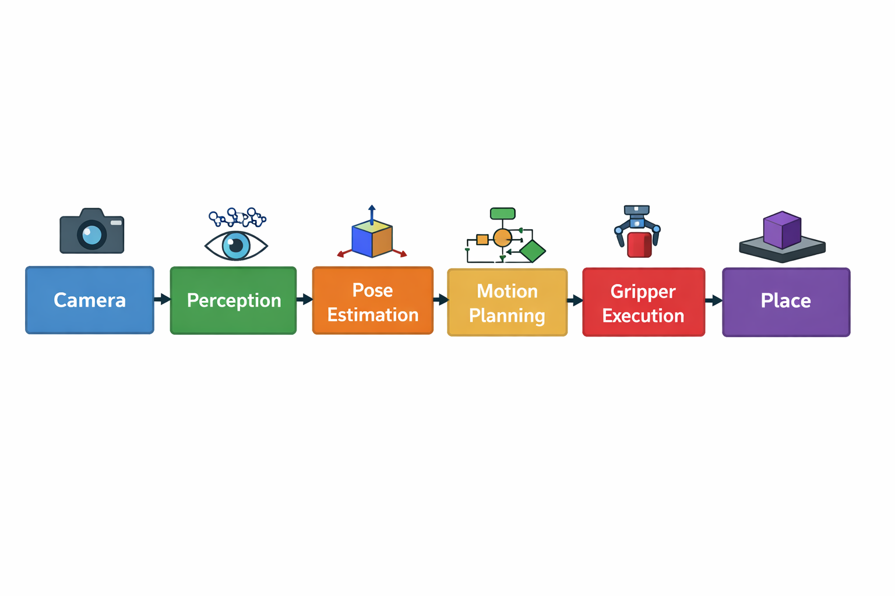

# Vision-Based Pick and Place using ROS2

This project demonstrates a simplified vision-based robotic pick-and-place
pipeline built using ROS2 simulation concepts.

## Overview
The system simulates a robotic manipulator with an eye-in-hand camera that:
1. Detects an object
2. Estimates pose
3. Plans motion
4. Executes pick and place

## System Architecture
Camera → Perception Node → Pose Estimation → Motion Planner → Gripper Control → Place

## Demo Video
The demo video for this project is included in the repository.

## Nodes Implemented
- perception_node.py  
  Publishes detected object pose in camera frame

- motion_planner.py  
  Receives object pose and plans pick-and-place motion

- gripper_control.py  
  Simulates gripper open/close commands

## ROS2 Structure
